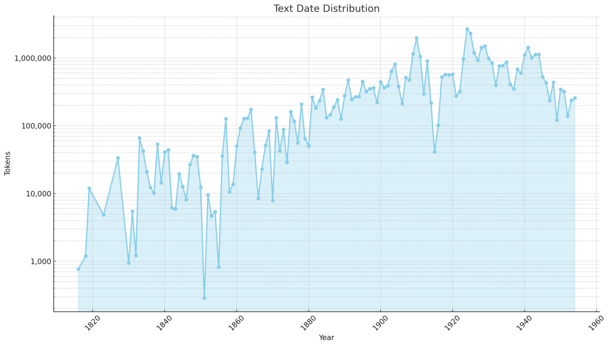

# PluG

The PluG (Pluperfect GRAC) corpus is a collection of Ukrainian texts from the General Regionally Annotated Corpus of Ukrainian (GRAC: [uacorpus.org](uacorpus.org)). It covers texts from 1816 to 1954, including various types such as fiction, news articles, and other writings. The corpus focuses on works from before the mid-20th century and contains texts by 7,590 unique authors and 44 unique translators.

The corpus features 42,000 files with 46,904,591 tokens (109M Gemma). It consists of copyright-free classic literature and other old texts suitable for LLM training, computational linguistics studies and education. The texts of the corpus were extracted from printed sources using OCR and corrected manually. It includes some texts written in old orthographical systems (Kulishivka, Zhelekhivka, Skrypnykivka). The texts come from various regions of Ukraine, with many from cities like Kyiv, Lviv, and Kharkiv. PluG includes both original Ukrainian works and translations from other languages.

The corpus is available under CC-BY license. It is designed as a dataset for applied linguistic studies, providing a valuable resource for research on Ukrainian literature, language development, and cultural history of the 19th and early 20th centuries. The corpus provides a wide range of metadata for each text, including information about authors, translators, years of publication, genres, styles, and locations. . Full tagset used in the meta-annotation are available on the GRAC website: [https://uacorpus.org/Kyiv/en/rozmitka-tekstiv/stili-tematika-i-zhanri](https://uacorpus.org/Kyiv/en/rozmitka-tekstiv/stili-tematika-i-zhanri) It's planned to be updated yearly to keep the resource up-to-date and valuable for researchers.

**Please cite** PluG:

_Maria Shvedova, Arsenii Lukashevskyi (2024): PluG: Corpus of Old Ukrainian Texts. Electronic resource: Kharkiv, Jena. Available at [https://github.com/Dandelliony/pluperfect\_grac](https://github.com/Dandelliony/pluperfect_grac)_

  

  

  

  

